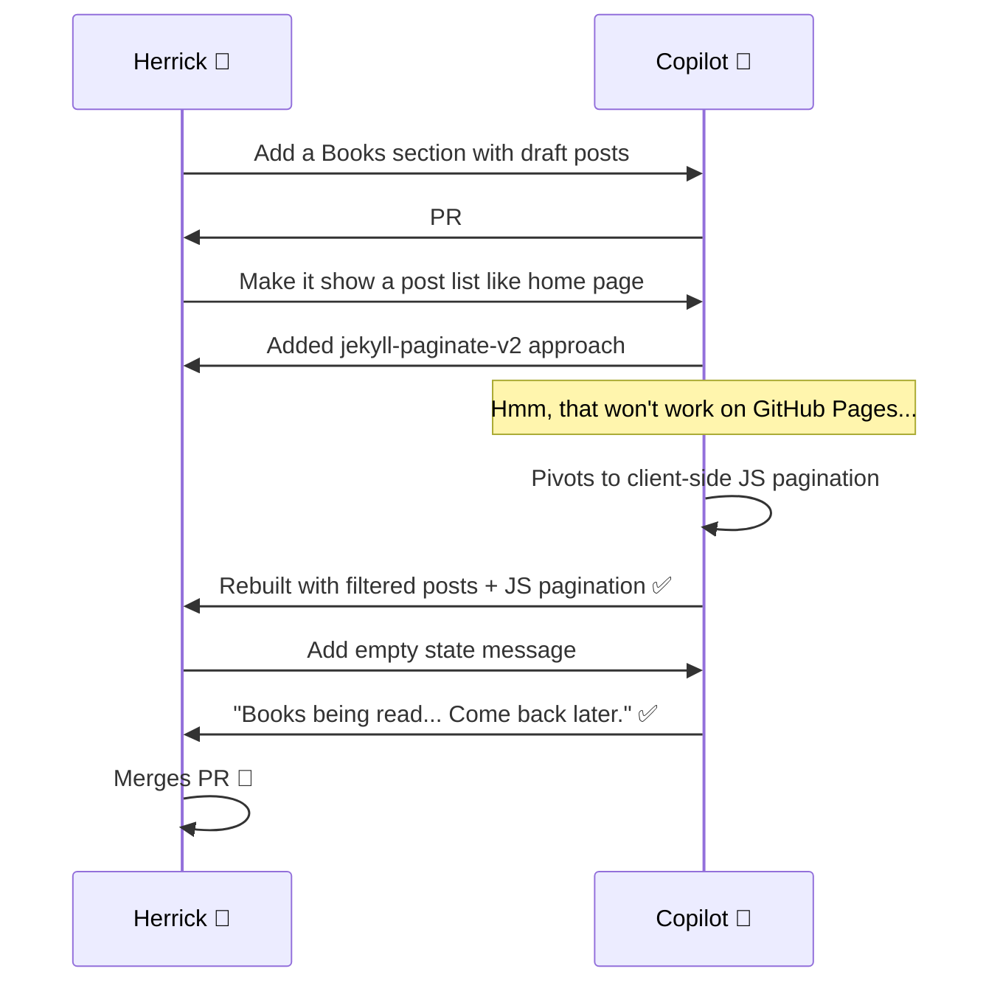

_**Note:** Since this feature was created using GitHub Copilot, I decided to have it assist in writing this blog post explaining the journey of creating that feature as well!_

## The Idea that Started with Bad Spelling

So there I was, staring at my growing stack of books (some physical, some Kindle, some Audible... I'm not picky about format) and thinking: _"I should really track what I'm reading somewhere."_ And since I already have this blog sitting here on GitHub Pages, why not add a Books section?

Now, in the old days I would have spent a weekend scaffolding markdown files, wrestling with Jekyll layouts, and consulting Stack Overflow approximately 47 times. But we're not in the old days anymore. I have a collaborator. A tireless one that doesn't need coffee breaks and never judges my spelling.

I opened up GitHub Copilot and typed something like this:

> "I'd like to add a new section to my GitHub Pages site which would house my thoughts and comments on the books I'm reading. If I gave you a list of the books I've read this year could you make a post for each of them?"

Simple enough. What followed was one of the best demonstrations I've had of what AI-assisted development _actually_ looks like when it's working well. Not the "fire and forget" vibe coding that gives you a mess to clean up... but a genuine back-and-forth collaboration. Like pair programming, except my partner has read every Stack Overflow answer ever written and doesn't get hangry at 3pm.

## Act 1: The Conversation

Before Copilot wrote a single line of code, it did something surprisingly human... it asked clarifying questions:

- _What's the repo URL and branch?_
- _Jekyll with what theme?_
- _What naming convention for files?_
- _Do you want original summaries or sourced descriptions?_

This is [Stage 5/6 stuff]() right here. The AI didn't just blindly execute, it made sure it understood the assignment. Like a smart intern on their first day who knows that asking good questions beats making bad assumptions.

I gave it my book list. And let me tell you... my spelling was... _creative_:

| What I Typed | What I Meant |
|---|---|
| "Michael kissagular" | Mihaly Csikszentmihalyi |
| "Sarah Wayne Williams" | Sarah Wynn-Williams |
| "RF Quan" | R.F. Kuang |

Copilot didn't even flinch. It correctly identified every single author and book from my butchered phonetic attempts. I can barely spell "Csikszentmihalyi" when I'm _looking_ at it, and here's Copilot going "Oh, you mean the Hungarian-American psychologist who wrote *Flow*? Got it." 🤷‍♂️

## Act 2: The First Pull Request

Within minutes, [PR #7](https://github.com/HerrickSpencer/HerrickSpencer.github.io/pull/7) appeared with **13 draft book posts** and a new Books navigation tab. Each post had a clean template:

- **Overview** — Title, author, publication date, genre, page count
- **Description** — A well-sourced summary with attribution links (no copyright issues!)
- **My Notes** — Placeholder section with writing prompts tailored to each book
- **Quotes** — Empty section ready for my highlights

Here's what one of those drafts looked like (for *Animal Farm*):

```markdown
## Overview

**Title:** Animal Farm
**Author:** George Orwell
**Published:** 1945
**Genre:** Political satire / Allegorical fiction

## Description

*Animal Farm* is a short allegorical novella by George Orwell...

> "All animals are equal, but some animals are more equal than others."

**Source:** Wikipedia – Animal Farm | Open Library

## My Notes

*[Your thoughts here — some prompts to get you started:]*

- What did this book make you think about?
- Were there characters or moments that stuck with you?
```

Thirteen of these. All correctly attributed. All with genre-appropriate discussion prompts. In _minutes_.

But this was just the opening move.

## Act 3: The Review — "This looks great! But..."

This is where it gets interesting. I reviewed the PR and dropped a comment:

> "This looks great! Some changes I'd like to see. In the books tab I'd like to automatically see a list of book posts, similar to the home page but filtered to only books. Include the paging navigation controls at the bottom as in home as well."

Now if this were a junior dev, you might expect a bit of back-and-forth to clarify what "similar to the home page" means. But Copilot understood the assignment immediately. It knew my site uses the Chirpy theme. It knew the home page has card-style post listings with pagination. It knew what I was after.

The flow looked something like this:



## Act 4: The Pivot — When Plan A Doesn't Survive Contact with Reality

Here's the part that really impressed me. Copilot's first instinct for pagination was to use `jekyll-paginate-v2`, a Jekyll plugin that supports pagination on any page (not just the root index). Smart choice! Makes total sense architecturally.

Except... GitHub Pages only supports a [limited set of Jekyll plugins](https://pages.github.com/versions/), and `jekyll-paginate-v2` isn't one of them. The standard `jekyll-paginate` only works on `index.html`. This is one of those gotchas that even experienced Jekyll devs stumble over.

So what happened? Copilot recognized the constraint and _pivoted_. Instead of trying to force the plugin or asking me to change my hosting, it:

1. **Removed** `jekyll-paginate-v2` from the Gemfile
2. **Switched** to using `site.posts` filtered by the Books category via Liquid templates
3. **Built** a client-side JavaScript pagination system that reads the site's `paginate` config value
4. **Added** URL hash-based page state (`#page=N`) so pagination URLs are shareable
5. **Matched** the Chirpy theme's pagination style with arrows, page numbers, and ellipsis

Four commits in about 30 minutes to completely rearchitect the approach. No complaints, no "well actually this would be easier if..." — just a clean solution that works within the constraints.

That's the kind of problem-solving adaptability that makes AI collaboration feel less like using a tool and more like working with a colleague who happens to be _very_ well-read on Jekyll internals.

## Act 5: The Polish

After the pagination was working, I had one more small request:

> "Add a message 'Books being read... Come back later.' when there are no book posts to show."

This was a tiny ask. But it's the kind of UX detail that matters — nobody wants to land on a blank page and wonder if the site is broken. Copilot added it in a single commit, wrapping the post list in a conditional that shows the friendly message when no books are published yet.

And that was it. Seven commits total, from initial plan to merge:

| # | Commit | What Changed |
|---|--------|-------------|
| 1 | `fcbe7a3` | Initial plan |
| 2 | `a3100a2` | 13 draft book posts + Books nav tab |
| 3 | `eb87fbe` | Pagination with jekyll-paginate-v2 |
| 4 | `5ddc41a` | Remove v2, switch to filtered posts |
| 5 | `492d7ca` | Match home.html card layout |
| 6 | `d1d0331` | Client-side JS pagination |
| 7 | `d4f9004` | Empty state message |

The entire conversation from first message to merged PR took place over the course of a single evening. From "hey I want a books section" to a fully functional, paginated, theme-consistent Books tab with 13 well-researched draft posts.

## What This Tells Us About AI Collaboration

Here's what struck me about this whole experience. It wasn't just that Copilot _did the work_ — any code generator can spit out files. It's _how_ the work happened:

**It asked before it assumed.** The clarifying questions at the start saved us from going down a wrong path. This is Stage 5 behavior from my [7 Stages of Vibe Coding]().

**It understood my intent, not just my words.** "Michael kissagular" → Mihaly Csikszentmihalyi. "Similar to the home page" → card layout with the exact same HTML structure and pagination controls. It grasped the _spirit_ of what I wanted.

**It pivoted gracefully when a plan failed.** The `jekyll-paginate-v2` → client-side JS switch happened without drama or hand-wringing. It recognized the constraint, adapted, and delivered a solution that was arguably _better_ (no extra plugin dependencies).

**It responded to feedback iteratively.** Each review comment led to a focused, clean commit. Not a massive rewrite, but surgical changes. This is how good collaboration works... in small, reviewable increments.

**The commits told a story.** Looking at the git history, you can see the evolution of thought. Initial approach → feedback → architectural pivot → refinement → polish. That's not vibe coding. That's engineering.

## The Takeaway

If you're still in the "type a prompt and hope for the best" camp with AI tools, I'd encourage you to try this style of collaboration instead. Open a conversation. Let the AI ask questions. Review the first pass. Give feedback. Watch it adapt. You'll be surprised how much it feels like working with a real co-author on your project.

The Books tab on this site is a small feature. But the _process_ of building it? That's the exciting part. That's where the future of software development is heading — not AI replacing developers, but AI _collaborating_ with them, one PR comment at a time.

Now if you'll excuse me, I have 13 book reviews to write. _That_ part, Copilot can't do for me. 📚

---

_Want to see the full conversation? Check out [PR #7](https://github.com/HerrickSpencer/HerrickSpencer.github.io/pull/7) on GitHub — the comments, commits, and code are all there._
