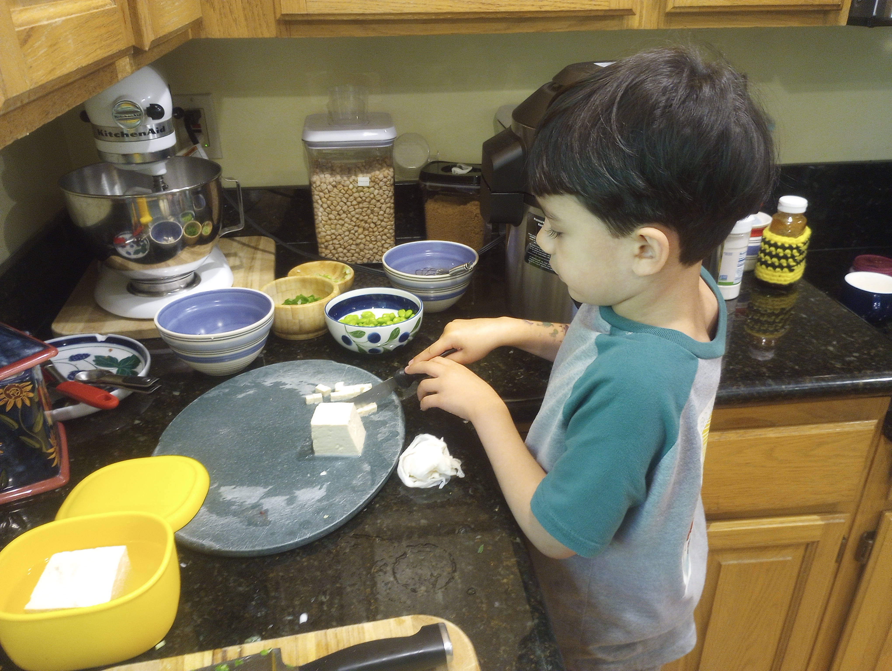
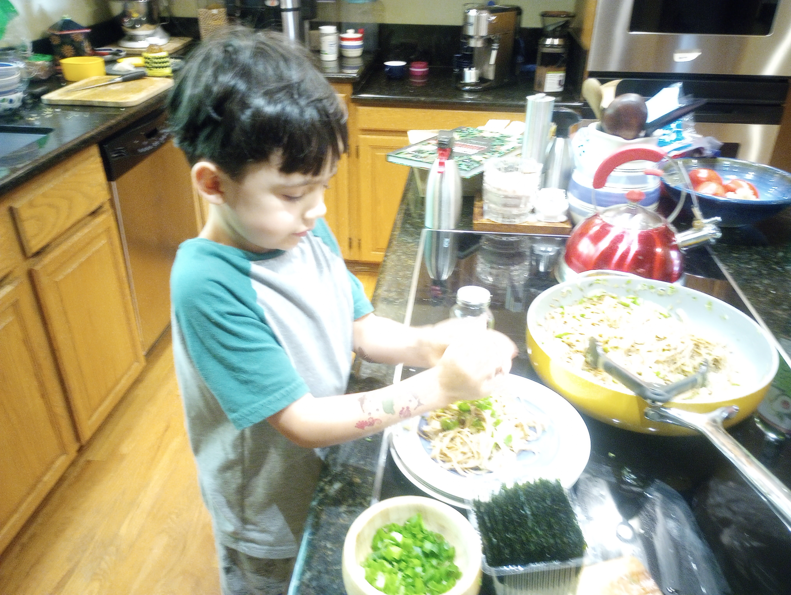
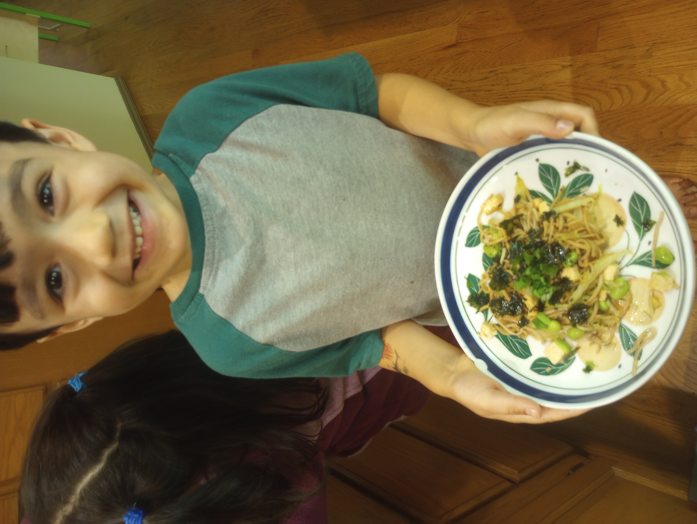

- PSA: < 0.03, undetectable!
- Support: Fiona and a lot of good friends (thanks for the lasagna)!

## Table of Contents

- [Day 0 of cycle : injection](#day-0-of-cycle--injection) = 2024/8/23
  - [Corrections about PET vs PSA](#corrections-about-pet-vs-psa)
  - [Possible admission to a UW cancer trial](#possible-admission-to-a-uw-cancer-trial)
  - [Lunch at our new ritual restaurant](#lunch-at-our-new-ritual-restaurant)
- [Day 1 of cycle](#day-1-of-cycle) = 2024/8/24
- [Day 2 of cycle](#day-2-of-cycle) = 2024/08/25
- [Day 3 of cycle](#day-3-of-cycle) = 2024/08/26
- [Day 4 of cycle](#day-4-of-cycle) = 2024/08/27
- [Day 5 of cycle](#day-5-of-cycle) = 2024/08/28
- [Day 6 of cycle](#day-6-of-cycle) = 2024/08/29
- [Day 7 of cycle (final shot)](#day-7-of-cycle-final-shot) = 2024/08/30
- [Day 8 of cycle? (HB's birthday!)](#HBs-Birthday) = 2024/08/31
- [Other things to mention](#other-things-to-mention)
- [Next Update:](#next-update)

I realized this round that really it is the week after infusion, and not even the day of that is the bad days... particularly days 4-8ish of the cycle that are the worst.  So in that frame of mind of it really being a week each round, that I only have 2 weeks of bad days left, with 2 weeks in between.  Not so bad when looking at it from that point of view.

## Day 0 of cycle : injection

Day started with me sleeping in big bed with kids... like a rock. I didn't even hear them come in. Kids and I woke up while Fiona was working out downstairs and we happily played and joked til she came up and yelled at us to get our lazy butts up. That sure changed the mood... 

I'm sure her mood was not improved by the fact that we forgot to put the ice packs we use to stave off neuropathy into the freezer the night before, so we had luke warm packs to try and save me from nerve damage in my feet and hands.  I opted to bring all the freezer packs we use for lunches and ouchies.  We ended up using them to decent effect.

The port access and blood draw is always the first order of the day, which went find despite me being in very down mood. It improved with the introduction of sugary croissant and tall americano after the appointment. The blood levels are normal as expected, with my platlets lower, but better than one could hope on the 5th treatment of these poisons.

### Corrections about PET vs PSA

There was a great discussion on whether I'd get a new PET scan and what that could tell us... Dr V informed me that I had it all backwards up until now. The PSA is actually a far better indicator that the cancer has been stopped than if we get all sort of false positive from the PET scan. The PSA test checks for nanograms of Prostate Specific Antogens in about 5mL off blood. This means that in the latest test they couldn't even find 0.03 billionths of a gram of PSA in a vial of 5mL of blood. That is a VERY small amount they could not detect.

### Possible admission to a UW cancer trial

Another thing we discussed, and ultimately applied to be considered for was a trial currently going on at the University of Washington to study if the standard of care is as good, worse, or better than a standard of care plus one other treatment. My current standard of care plan for mHSPC (Metastatic Hormone-Sensitive Prostate Cancer) is ADC (Androgen Deprivation + Chemotherapy), but if in the experimental side of the trial, this would mean that they would also add radiation therapy on to the package to determine if this has an improved life expectancy. The current data suggests that it does.

### Lunch at our new ritual restaurant

We have been going to Kati Vegan Thai just down the road from the hospital in Totem Lake after many of the infusions, and this day was no different. We have a nice chat with the waitress, Kasi, who used to work there full time but is pursuing yoga instructor interests so is only there sporadically. Very delicious food here, if you are a carnivore that loves curry and pad thai... this is really the place to forget that you aren't eating meat.  I suggest the Pumpkin Curry on a cold day, and Red Curry or the Pad Thai any other. The red rice that it comes with is amazing as well. The whole meal/experience really is spectacular.

## Day 1 of cycle

I could not sleep a wink last night... and spent 5 hours binge watching videos on both NodeJS/Express  and basic authentication patterns for a side project instead. This was very fruitful, but left me in a terrible state for the morning. Two cups of coffee later though and I am ready to rock... I'm pretty sure there is a wall heading my way for the end of the day when I'll need to be helping get the kids to bed. 

HB is coughing so I'm likely going to be sleeping in the spare room when he eventually comes into the big bed tonight. Thankfully Fiona had a good idea we've been doing of training them to sleep in their own beds this past 2 weeks, and that has largely seen a lot of success.

They are all out right now at a birthday party for one of HB's classmates, so I've got the quiet place to myself, which is a blessing, but I'm still not sure how to take a nap.  Instead I've been super productive in my blog posts and creating this Auth flow for the other site my brother and I are working on for the family. 

I've had as much liquid as could go down my throat as well as a **very** nice smoothie I created out of Oat milk, banana, Blueberry Yoghurt, and tofu for protein. It turned out really good. I'll likely do more of this as this is a much better 'snack' for me than the lesser choices I've been eating between meals.  I may write a post about the best diets and avoidable foods to keep you as far from cancer as possible.

## Day 2 of cycle

We planned ahead and had a babysitter for the weekend and Monday due to a teacher appreciations day where the kids will be at home tomorrow. This meant that Fiona could go to her normal yoga routine while I made breakfast for the kids and got them ready for the day. After the sitter arrived I was able to take it easy, and even got a brief nap in. Muscle soreness is the biggest issue right now, everything I do feels like I've been lifting weights at the gym.

HB and I planned to make a dish for dinner from a cookbook we'd bought that had a bunch of recipes from the Studio Ghibli movies. Tonight we made Onion Soba Noodles from Only Yesterday. It was fantastic.
{: height="200" width="250"}
{: height="200" width="250"}  
{: height="300" width="300"}  

## Day 3 of cycle

Nausea and muscle aches, nausea mostly is the issue...

I got some work done, had a few necessary meeting with colleagues, but was super certain this was not going well.  I barely helped with the kids routine and dinner/bath-time. Luckily Larissa came through with a turkey lasagna so dinner was much more manageable... I ate too much of it and was forced to go to bed early by Fiona when I was acting like a zombie.

## Day 4 of cycle

Took the day off.... nausea was a beast of a thing and so tired I didn't want to do anything but watch TV in-between bouts of napping on the couch.  Appetite was still high though, I'd guess because I'm regrowing most of my blood supply and likely trying to replace the lost muscle mass being destroyed.  Weight has not changed (luckily?).

## Day 5 of cycle

More of yesterday, nausea and couch napping... I feel like dirt.

## Day 6 of cycle

Why not make it a trifecta?!

## Day 7 of cycle (final shot)

Friday and feeling a very small bit better... had some meetings with colleagues and developing some plans for our feature rollout policies.  Ironically this was supposed to be our coordinated day off at work, but at least three of us were still working.

I was even able to run out to pickup the cake and some last supplies for HB's birthday bash tomorrow.

## HBs Birthday

This was a blast... I'm so glad my energy was finally returning just in time, and that I'd prepared the week prior so it didn't have to be done while I was under the influence of the dark side of medicine.

We got down to the park and started setting up the picnic area with table cloths, banners, and balloons; all were in a Minecraft style. We had more friends show up than expected being a three day weekend. We had a Minecraft Creeper pinata that was a hit (pun intended). It was lovely to have a last gathering of pre-school friends before all of the kids head off to separate elementary schools.

Sofia, officially HB and Arya's Aunt or Sister (we haven't figured out the DNA yet), was rushing to the park to help out... and unfortunately was in a car accident... I felt horrible for her, but glad all were unharmed in the event.  She trooped on and was a god-send at the event as always.  And... as always, Arya captivated most of her time as if she was her possession. Thank you Sofia, you are an angel.

Shout out to "GA", the hit of the party, a newborn baby that has been anxiously awaited for by the parents for the last 3+ years.  I'm so happy for the parents and congrats to them... I had so much fun holding this little dude, as did Arya (til she got bored and pushed him back to mom).

As soon as I arrived home, I passed out on the couch for an hour.... it was a long hot 87°F day with too much energy spent. Boy was it fun.

## Other things to mention

The solo run experiment was a mild success I'd say... it was not impossible as we thought, but with each cycle being harder than the last, it was not super easy either. I definitely prefer the help in the mornings and bed-time. I was utterly useless to Fiona at times, which I'm sure was not easy for her, so a big 'I love you' to Fiona... my partner in this stupid adventure.

I'm just so glad and anxious that I am only one cycle away from completing this ridiculously barbaric and stone-age level 'medical therapy'.




## Next Update:  

  
[{{ post.title }}]({{ post.url }})Karen and 
  

