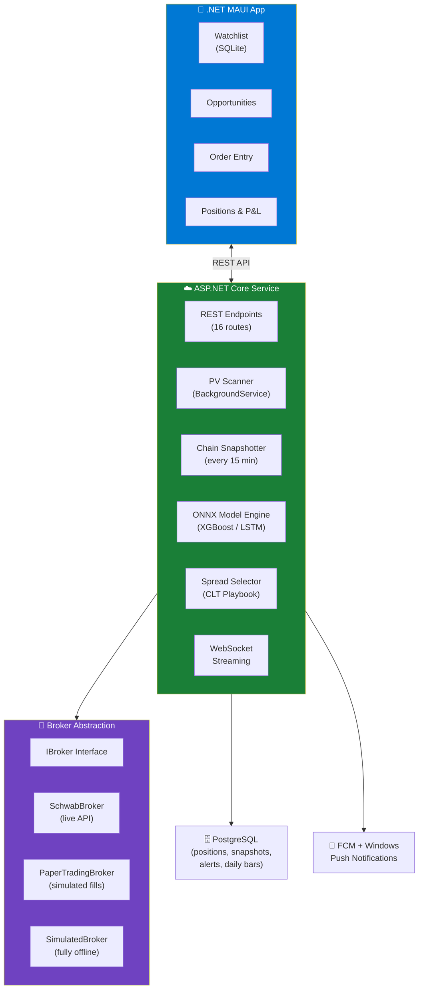
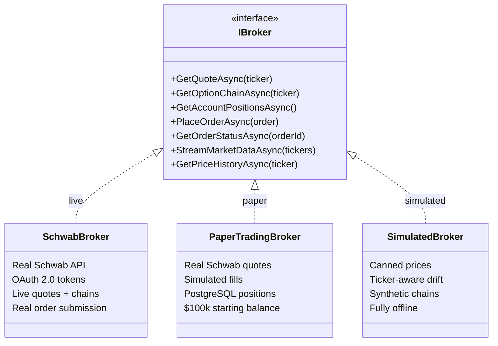
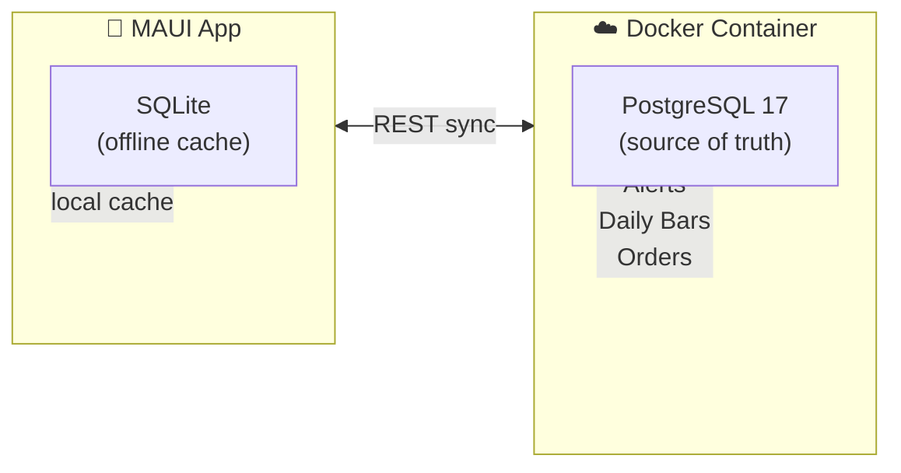
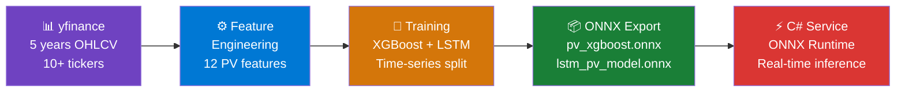

## The Itch I Had to Scratch

So there I was, watching a video from Brandon Powers' CLT Options methodology — price and volume analysis for timing options spreads — and thinking: _"This is great... but what if I didn't have to stare at charts all day?"_

What if a system could watch my tickers, recognize the same PV setups Brandon teaches, and just... tap me on the shoulder when it sees something? Push notification, pre-filled order, one tap to trade. Done.

And thus, **StrikeAlert** was born. A cross-platform app built with .NET MAUI, backed by a cloud ML service, that monitors your watchlist and pushes real-time options spread alerts based on price-and-volume analysis. Android, Windows, XGBoost, LSTM, Schwab API, Docker, PostgreSQL, SQLite — the whole kitchen sink.

_What could possibly go wrong?_

## The Architecture (aka "How Many Technologies Can One Person Use?")

Here's the high-level view. Fair warning: there are _layers_.



The MAUI app is the user-facing piece — watchlist management, opportunity feed, order entry, and a positions dashboard. Under the hood it talks REST to an ASP.NET Core backend that does all the heavy lifting: PV scanning, ML inference, options chain snapshotting, and broker communication.

But the part I'm probably most proud of? The abstractions.

## The Broker Abstraction: Three Modes, One Interface

Early on I realized that Schwab's API has a _delightful_ limitation: **no paper trading API**. Zero. Nada. You can log into thinkorswim paperMoney on your phone like a normal human, but programmatically? Nope. Every API call hits your real money account.

So I needed a way to test the full trading flow without, you know, accidentally buying $10,000 worth of AAPL calls while debugging.

The solution: an `IBroker` interface that every part of the system codes against, with three implementations:



Flip a config value in `appsettings.json` and the entire system switches modes:

| Mode | Quotes | Fills | Database | Use Case |
|------|--------|-------|----------|----------|
| `simulated` | Canned data | In-memory | PostgreSQL | Offline testing, CI |
| `paper` | Real Schwab API | Simulated | PostgreSQL | Validate strategy with real prices |
| `live` | Real Schwab API | Real money | PostgreSQL | _Don't touch this until you're sure_ |

The `PaperTradingBroker` is the sweet spot — it calls `SchwabBroker` for real-time quotes and options chains, but fills orders at mid-price into PostgreSQL. You get realistic market data with zero financial risk. The `SimulatedBroker` is for when you don't even have Schwab tokens handy (or it's 2 AM and the market is _very_ closed).

This abstraction also means I could swap in Interactive Brokers, Alpaca, or any other brokerage down the road without touching the app or scanner code. Future-proofing that actually paid off during development... which is rare.

## The Data Layer: SQLite Meets PostgreSQL Meets Docker

One of the more interesting architectural decisions was having _two_ databases serving different roles:



**SQLite** lives on-device in the MAUI app. It holds a local copy of the watchlist so the app works offline. When you add a ticker, it goes to the server first (PostgreSQL is the source of truth), and only saves locally after the server confirms. No more ghost tickers from failed network calls.

**PostgreSQL** runs in Docker (via a simple `docker-compose.yml`) and stores _everything_: watchlists, paper trading positions, order history, options chain snapshots, daily OHLCV bars, alerts, and user preferences. At scale, the options snapshots alone could hit 25 GB/year for 200 tickers — PostgreSQL handles this without breaking a sweat.

The Docker setup is dead simple:

```yaml
services:
  postgres:
    image: postgres:17
    container_name: strikealert-db
    ports:
      - "5432:5432"
    volumes:
      - strikealert-pgdata:/var/lib/postgresql/data
```

One `docker compose up` and you've got a database. No installer, no Windows service, no "which version of Postgres did I install again?" headaches. I even have a production overlay (`docker-compose.prod.yml`) with health checks and log rotation for the VM deployment.

## The ML Pipeline: From Python to ONNX to C#

This was the part that felt the most like _actual_ science. The CLT playbook methodology boils down to reading price and volume together — a breakout with high volume means conviction; a price move on thin volume means weakness. So I needed to turn that intuition into math.



The **Python pipeline** (`StrikeAlert.ML/`) downloads historical data via `yfinance`, engineers 12 features from the PV methodology (volume ratios, RSI, MACD, VWAP deviation, OBV slope, etc.), and trains both an **XGBoost** classifier and an **LSTM** neural network. The models get exported to **ONNX** format.

The **C# service** loads the ONNX model at startup via `Microsoft.ML.OnnxRuntime` and runs inference behind an `IModelEngine` interface. The service prefers the LSTM model if it exists, falling back to XGBoost. Same abstraction pattern as the broker — swap implementations without changing calling code.

The backtesting results were... honestly a bit _suspiciously_ good. Walk-forward evaluation across 8 windows gave a mean F1 of 0.989. But with rule-based labeling (volume > 2× average AND |price change| > 1%), the model is essentially learning to detect volume spikes... which, well, isn't exactly subtle. The real test will come when I switch to **outcome-based labeling** — using actual paper trade P&L to train the model on what _actually makes money_, not just what _looks_ like a setup.

The feedback loop is already wired: trade outcomes flow back from PostgreSQL to the Python pipeline via a `/api/outcomes` endpoint. Once I accumulate enough closed trades (~50+), retraining on real results should yield a much more honest accuracy picture.

## The Scanner: Two Speeds

The service runs two scanning modes as `BackgroundService` instances:

**Scheduled Scanner** — Every 5 minutes during market hours (9:30 AM – 4:00 PM ET, Mon–Fri), it iterates through every watchlist ticker, runs ML batch predictions, and stores alerts. Like a diligent intern checking all the charts on a timer.

**Real-time Scanner** — Consumes Schwab's WebSocket streaming API, watching for volume spikes in real-time. When incremental volume exceeds 2× the 5-minute average, it triggers an immediate ML prediction. This catches fast-moving setups that the 5-minute scanner might miss.

Both scanners respect user preferences: minimum confidence thresholds, per-ticker cooldowns (so you don't get 47 notifications about the same AAPL setup), strategy filters, and a daily alert cap. Because nobody wants their phone buzzing every 30 seconds during a volatile market day.

## The VM Data Collector: Because Laptops Sleep

Here's something I didn't think about initially: options chain snapshots are **irreplaceable**. Schwab provides real-time chains but _zero_ historical options data. If my laptop sleeps through market hours, those snapshots are gone forever.

The solution? A dedicated VM (either a local Hyper-V box or an Azure B1s at ~$8/month) running the service in Docker, collecting snapshots every 15 minutes during market hours. It builds a proprietary dataset over time — one that no free API can give you.

I wrote export/import PowerShell scripts so I can pull the collected data back to my dev machine for ML training. The dev machine and VM are completely independent — one is for coding, the other is for relentless data collection.

## The MAUI App: One Codebase, Two Platforms

The .NET MAUI app targets both **Android** and **Windows** from a single C# / XAML codebase. On desktop, you get a split-pane dashboard with watchlist, opportunities, and positions side by side. On mobile, it's a flyout-nav experience designed for quick glance-and-trade workflows.

The views:

- **Dashboard** — overview with badges for watching tickers, active alerts, and open positions
- **Watchlist** — add/remove tickers, pull-to-refresh, swipe-to-delete
- **Opportunities** — ML-detected alerts with color-coded direction cards (green for bull, red for bear)
- **Order Entry** — pre-filled from the ML suggestion with spread leg builder and cost validation
- **Positions** — account summary, open positions with live P&L, order history
- **Settings** — risk tolerance, confidence threshold, notification controls
- **Service Health** — token status, service connectivity, re-auth button

Everything uses MVVM via `CommunityToolkit.Mvvm`, and the API client is a typed `HttpClient` wrapper behind an `IStrikeAlertApi` interface in the shared library. Same contract on both sides of the wire.

## What Copilot Brought to the Table

I'd be lying if I said I didn't have help. This entire project was built collaboratively with GitHub Copilot, following the [AI Task Flow]() methodology I've written about before. Each phase went through a structured plan → implement → review → iterate cycle.

Some highlights of what AI collaboration looked like on this project:

- **Phase 1 scaffolding** — Copilot set up the entire solution structure, DI wiring, and the `IBroker` abstraction in a single session. The clarifying questions it asked about broker modes saved me from a design mistake I wouldn't have caught until Phase 3.
- **The Schwab OAuth dance** — OAuth 2.0 with a 7-day refresh token and 30-minute access token is... not fun. Copilot nailed the token lifecycle management, including the disk-persistence and 60-second refresh buffer, on the first try.
- **PV Feature Engineering** — Getting 12 financial indicators implemented identically in both Python (for training) and C# (for inference) was error-prone. Having Copilot cross-reference the two implementations caught a subtle RSI calculation difference that would have silently degraded predictions.
- **Cross-platform timezone bug** — `TimeZoneInfo("Eastern Standard Time")` works on Windows but explodes on Linux/Docker. Copilot caught this during the Docker deployment and centralized it into a `MarketHours.GetEasternTimeZone()` helper with an `America/New_York` fallback.

The project went from empty repo to 70 passing tests, 16 API endpoints, two ML models, and a working paper-trading pipeline in about two weeks. I'm not saying I couldn't have done it solo... but it would have taken a _lot_ more weekends.

## Current Status & What's Next

As of now, the system is fully operational in paper trading mode:

- ✅ **5 phases complete** — foundation, data & model, cloud service, end-to-end flow, refinement
- ✅ **70 tests passing** across C# and Python
- ✅ **VM collecting data** — options chain snapshots accumulating daily
- ✅ **Two ML models** — XGBoost and LSTM, both exported to ONNX

What's on the backlog:

- 🔲 Firebase push notifications (Android end-to-end)
- 🔲 Interactive price charts on the desktop dashboard
- 🔲 Model retraining on real trade outcomes (need ~50+ closed trades)
- 🔲 CI/CD pipeline via GitHub Actions
- 🔲 The big one: flipping to `live` mode with real money 💸

That last one is... going to require a few more deep breaths and maybe a stiff drink. But that's the whole point of the paper trading phase — prove the model works _before_ you let it anywhere near your actual brokerage account.

## The Takeaway

If you're thinking about building a personal trading tool, here's what I'd tell you:

1. **Abstract everything.** The broker, the ML model, the data source — put interfaces in front of all of them. You _will_ swap implementations, and you'll thank yourself later.
2. **Paper trade first.** Seriously. Build the full pipeline with simulated fills before touching real money. The `PaperTradingBroker` pattern (real quotes, fake fills) is the sweet spot.
3. **Collect your own data.** If your data source doesn't offer historical options chains (Schwab doesn't), start snapshotting from day one. A $8/month VM pays for itself in irreplaceable training data.
4. **AI collaboration works.** Not "generate and pray" — actual structured collaboration with plans, reviews, and iteration. The [AI Task Flow]() approach turned a massive project into manageable phases.

Now if you'll excuse me, I need to go check if my VM is still collecting snapshots. Because _that_ data is irreplaceable... and I may have accidentally rebooted it during a Windows Update. 😬

---

_StrikeAlert is a personal project and not financial advice. Options trading involves risk of loss. Don't let an ML model yeet your retirement savings into weekly SPY puts._
